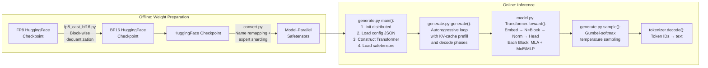
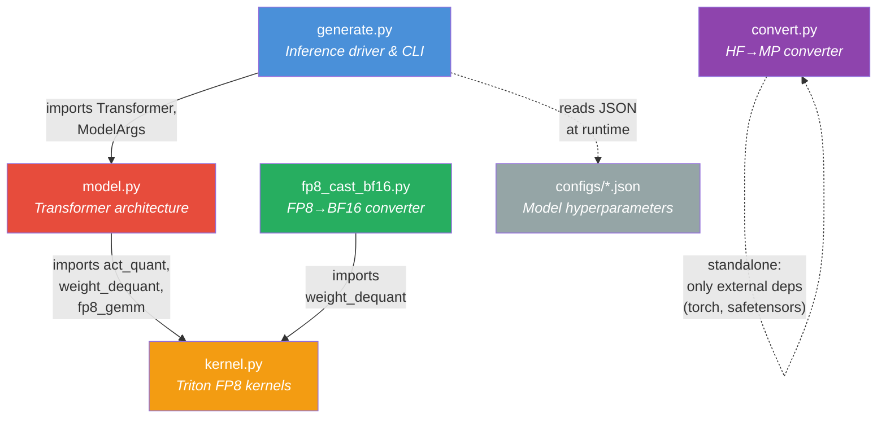
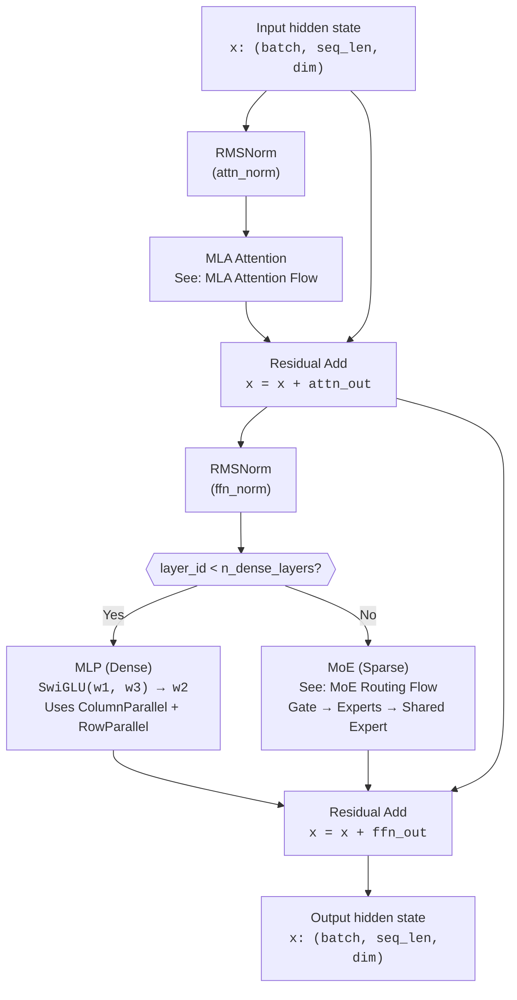
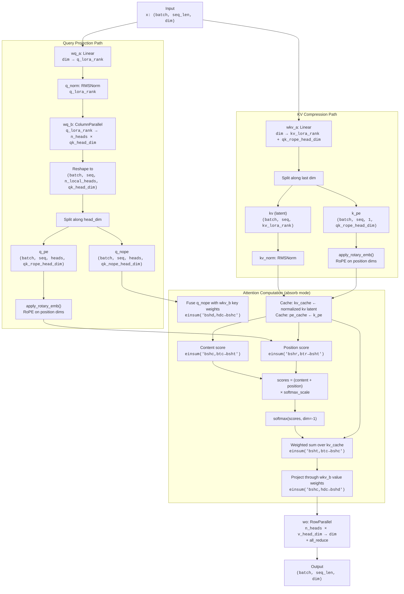

# DeepSeek-V3 Inference Architecture

## Table of Contents

- [Overview](#overview)
- [Pipeline Stages](#pipeline-stages)
- [Module Dependency Graph](#module-dependency-graph)
- [Key Architectural Decisions](#key-architectural-decisions)
  - [Multi-Head Latent Attention (MLA)](#1-multi-head-latent-attention-mla)
  - [DeepSeekMoE with Auxiliary-Loss-Free Balancing](#2-deepseekmoe-with-auxiliary-loss-free-load-balancing)
  - [FP8 Block-wise Quantization](#3-fp8-block-wise-quantization)
  - [Naive vs. Absorb Attention](#4-naive-vs-absorb-attention-strategies)
  - [Multi-Token Prediction (MTP) Module Exclusion](#5-multi-token-prediction-mtp-module-exclusion)
- [Transformer Block Architecture](#transformer-block-architecture)
- [MLA Attention Flow](#mla-attention-flow)
- [MoE Routing Flow](#moe-routing-flow)
- [Distributed Execution Model](#distributed-execution-model)
- [Weight Conversion Paths](#weight-conversion-paths)
- [Glossary](#glossary)

---

## Overview

This document provides a comprehensive architectural overview of the **DeepSeek-V3 inference codebase**, which implements the inference pipeline for a 671-billion-parameter Mixture-of-Experts (MoE) language model with approximately 37 billion active parameters per forward pass.

**Scope:** This codebase covers inference-only functionality, including:

- **Model definition** — Transformer architecture with Multi-Head Latent Attention (MLA) and DeepSeekMoE layers (`model.py`)
- **Token generation** — Autoregressive text generation with KV-cache-aware decoding (`generate.py`)
- **Checkpoint conversion** — HuggingFace-to-model-parallel weight transformation (`convert.py`)
- **FP8 quantization support** — Block-wise FP8-to-BF16 dequantization and native FP8 GEMM kernels (`fp8_cast_bf16.py`, `kernel.py`)

The codebase supports distributed inference via PyTorch's `torch.distributed` with NCCL backend, partitioning vocabulary embeddings, attention heads, feed-forward dimensions, and routed experts across multiple GPUs.

**Reference:** For full model architecture, training methodology, and evaluation results, see the DeepSeek-V3 technical report: [arXiv:2412.19437](https://arxiv.org/abs/2412.19437). Key sections referenced throughout this document:

| Report Section | Topic | Codebase Mapping |
|---|---|---|
| Section 2.1.1 | Multi-Head Latent Attention (MLA) | `model.py`: `MLA` class |
| Section 2.1.2 | DeepSeekMoE with auxiliary-loss-free balancing | `model.py`: `Gate`, `Expert`, `MoE` classes |
| Section 2.2 | Multi-Token Prediction (MTP) | `convert.py`: layer-61 skip logic |
| Section 3.3 | FP8 block-wise quantization | `kernel.py`: all Triton kernels |

For weight file structure and FP8 storage format, see [`../README_WEIGHTS.md`](../README_WEIGHTS.md).
For configuration parameter details, see [`configs/CONFIG_REFERENCE.md`](configs/CONFIG_REFERENCE.md).

---

## Pipeline Stages

The inference pipeline progresses through four major stages, spanning multiple modules:



### Stage Descriptions

| Stage | Module | Entry Point | Description |
|---|---|---|---|
| **Weight Preparation (HF→MP)** | `convert.py` | `main()` | Remaps HuggingFace weight names to internal naming convention, shards weights across model-parallel ranks, partitions routed experts, and skips layer 61 (MTP module). Produces `model{rank}-mp{world_size}.safetensors` files. |
| **Weight Preparation (FP8→BF16)** | `fp8_cast_bf16.py` | `main()` | Dequantizes FP8 E4M3 weights to BF16 using block-wise scale factors via `kernel.weight_dequant()`. Processes each safetensor shard, rewrites the model index JSON to remove `scale_inv` references. |
| **Model Initialization** | `generate.py` | `main()` | Initializes distributed process group (NCCL), loads config JSON into `ModelArgs`, constructs `Transformer` on CUDA, loads pre-converted safetensors weights. Runs a warm-up generation pass. |
| **Token Generation** | `generate.py` | `generate()` + `sample()` | Autoregressive loop: prefills prompt tokens through the model, then decodes new tokens one at a time using KV cache. Uses Gumbel-softmax sampling via the exponential distribution trick. Returns completed sequences truncated at EOS. |

---

## Module Dependency Graph

The five Python modules under `inference/` have the following import relationships:



### Module Roles

| Module | Lines | Role | Key Exports |
|---|---|---|---|
| **`model.py`** | ~800 | Defines the full Transformer architecture: embeddings, attention (MLA), feed-forward (MLP/MoE), gating, normalization, and the top-level `Transformer` class. Sets global distributed state (`world_size`, `rank`). | `Transformer`, `ModelArgs`, `MLA`, `MoE`, `Gate`, `Block`, `Linear`, `RMSNorm` |
| **`generate.py`** | 186 | Inference entry point. Handles distributed initialization, model loading, interactive/batch token generation, and CLI argument parsing. | `sample()`, `generate()`, `main()` |
| **`kernel.py`** | 197 | Triton GPU kernel library for FP8 quantization, dequantization, and matrix multiplication. Provides the computational backbone for FP8 inference. | `act_quant()`, `weight_dequant()`, `fp8_gemm()` |
| **`convert.py`** | 97 | Offline utility to convert HuggingFace checkpoints to model-parallel safetensors format. Standalone module with no internal imports. | `main()` |
| **`fp8_cast_bf16.py`** | 113 | Offline utility to dequantize FP8 weights to BF16 format using `kernel.weight_dequant()`. | `main()` |

---

## Key Architectural Decisions

### 1. Multi-Head Latent Attention (MLA)

**Reference:** [arXiv:2412.19437, Section 2.1.1](https://arxiv.org/abs/2412.19437)

**What:** MLA replaces standard Multi-Head Attention (MHA) and Grouped-Query Attention (GQA) with a latent compression scheme for keys and values. Instead of caching full per-head K and V tensors, MLA compresses them into a shared low-rank latent representation, dramatically reducing KV cache memory requirements.

**Why MLA over MHA/GQA:**

| Approach | KV Cache per Token | Trade-off |
|---|---|---|
| Standard MHA | `n_heads × d_head × 2` (K + V) | Full capacity, high memory |
| GQA | `n_kv_groups × d_head × 2` | Reduced memory, some capacity loss |
| **MLA** | **`kv_lora_rank + qk_rope_head_dim`** | Minimal memory, full capacity via learned compression |

For the 671B model: MLA caches `512 + 64 = 576` floats per token, compared to `128 × (128 + 128) × 2 = 65,536` floats for standard MHA with 128 heads and 128-dim heads. This is a **~114× reduction** in KV cache size.

**Implementation:** See the `MLA` class in [`model.py`](model.py) (lines 396–497). Key components:

- **Query LoRA decomposition** (`wq_a` → `q_norm` → `wq_b`): Decomposes the query projection through a low-rank bottleneck (`q_lora_rank = 1536` for 671B) to reduce parameters.
- **Joint KV compression** (`wkv_a`): Projects input into a combined latent of size `kv_lora_rank + qk_rope_head_dim`, where the first `kv_lora_rank` dimensions encode compressed content features and the remaining `qk_rope_head_dim` dimensions carry position-dependent key features for RoPE.
- **Decoupled RoPE**: Rotary position embeddings are applied only to a separate `qk_rope_head_dim`-dimensional component (`k_pe`), keeping the latent content representation position-independent. This is critical because applying RoPE to compressed features would break the low-rank structure.
- **Two attention strategies**: `naive` (standard materialization) and `absorb` (fused projection). See [Naive vs. Absorb Attention](#4-naive-vs-absorb-attention-strategies) below.

### 2. DeepSeekMoE with Auxiliary-Loss-Free Load Balancing

**Reference:** [arXiv:2412.19437, Section 2.1.2](https://arxiv.org/abs/2412.19437)

**What:** DeepSeekMoE routes each token to a subset of specialized expert networks, activating only `n_activated_experts` out of `n_routed_experts` total experts per token. The 671B model uses 256 routed experts with 8 activated per token, plus 1 shared expert that processes all tokens.

**Why Auxiliary-Loss-Free Balancing:**

Traditional MoE models add an auxiliary loss term to the training objective to encourage balanced expert utilization. This auxiliary loss can conflict with the primary language modeling loss, degrading model quality. DeepSeek-V3 instead uses a **learned per-expert bias** added to gating scores during routing. The bias nudges underutilized experts upward without modifying the training loss function.

**Implementation:** See the `Gate`, `Expert`, and `MoE` classes in [`model.py`](model.py) (lines 535–693).

- **`Gate` class** (line 535): Implements the routing function.
  - Computes raw scores via linear projection: `scores = linear(x, self.weight)`
  - Applies sigmoid scoring for the 671B model (`score_func = "sigmoid"`), while the 16B and 236B variants use softmax
  - Adds the learned `self.bias` parameter to scores for load balancing. The bias is only allocated when `self.dim == 7168` (the 671B model dimension), since smaller variants were trained with auxiliary-loss-based balancing (softmax scoring) and do not use bias correction.
  - Performs two-stage routing: first selects `topk_groups` expert groups, then selects `topk` experts within those groups.

- **`Expert` class** (line 601): Each expert is a SwiGLU MLP with three linear projections (`w1`, `w2`, `w3`), identical in structure to the dense `MLP` class but operating on `moe_inter_dim` instead of `inter_dim`.

- **`MoE` class** (line 636): Orchestrates expert routing and computation.
  - Partitions experts across distributed ranks: each rank holds `n_local_experts = n_routed_experts // world_size` experts.
  - After local expert computation, uses `dist.all_reduce(y)` to aggregate results across all ranks.
  - Adds shared expert output (`self.shared_experts`) to the routed expert output. Shared experts process all tokens and are not subject to routing.

### 3. FP8 Block-wise Quantization

**Reference:** [arXiv:2412.19437, Section 3.3](https://arxiv.org/abs/2412.19437)

**What:** DeepSeek-V3 natively supports FP8 (8-bit floating point) weights using the E4M3 format (4-bit exponent, 3-bit mantissa, max representable value ≈ 448). Weights are quantized at **128×128 block granularity**, where each block has its own floating-point scale factor.

**Why Block-wise over Per-tensor or Per-channel:**

- **Per-tensor quantization** uses a single scale for the entire weight matrix, which fails to capture local value distributions and introduces significant quantization error for large models.
- **Per-channel quantization** uses one scale per row or column, adding overhead proportional to a dimension of the weight matrix.
- **Block-wise quantization (128×128)** provides a balance: fine-grained enough to capture local value ranges while keeping scale tensor overhead manageable (scale tensor is `(M/128, N/128)` relative to weight matrix `(M, N)`).

**Three GEMM Paths in `linear()`:**

The `linear()` function in [`model.py`](model.py) (line 131) dispatches to one of three computational paths based on weight format and the global `gemm_impl` setting:

| Condition | Path | Description |
|---|---|---|
| `weight.element_size() > 1` | Standard BF16 | Weight is already in BF16/FP32; uses `F.linear()` directly. |
| `gemm_impl == "bf16"` | Dequantize + BF16 GEMM | Weight is FP8; dequantizes via `weight_dequant()` then uses `F.linear()`. |
| `gemm_impl == "fp8"` | Native FP8 GEMM | Weight is FP8; quantizes activations via `act_quant()` then calls `fp8_gemm()` for fused FP8 matrix multiplication. |

**Kernel Implementation:** See [`kernel.py`](kernel.py) for the Triton kernel implementations:

- `act_quant_kernel`: Quantizes activations to FP8 E4M3 with per-block scale factors. Computes `scale = max(|block|) / 448`, where 448 is the maximum representable value in E4M3 format. Supports optional `ue8m0` scale format (8-bit unsigned exponent-only) for hardware compatibility.
- `weight_dequant_kernel`: Dequantizes FP8 weights by multiplying each 128×128 block by its corresponding scale factor.
- `fp8_gemm_kernel`: Block-tiled FP8 matrix multiplication with per-block scale accumulation. Uses Triton autotuning over 36 configurations (3 `BLOCK_SIZE_M` × 3 `BLOCK_SIZE_N` × 4 `num_stages`), with `BLOCK_SIZE_K` fixed at 128 to align with the quantization block size.

For FP8 weight file format and dequantization details, see [`../README_WEIGHTS.md`](../README_WEIGHTS.md).

### 4. Naive vs. Absorb Attention Strategies

**What:** The `MLA` class supports two distinct attention computation strategies, selected by the global `attn_impl` variable (default: `"absorb"`):

**Naive Mode** (`attn_impl = "naive"`):

- Materializes full per-head keys and values by projecting the compressed KV latent through `wkv_b`.
- Caches `k_cache` of shape `(batch, max_seq_len, n_local_heads, qk_head_dim)` and `v_cache` of shape `(batch, max_seq_len, n_local_heads, v_head_dim)`.
- Computes attention via standard `Q·K^T` dot product and `scores·V` weighted sum.
- Higher memory usage due to per-head K and V caches, but simpler to understand and debug.

**Absorb Mode** (`attn_impl = "absorb"`, default):

- Instead of materializing keys and values, fuses the `wkv_b` projection weight into the query computation.
- Caches only the compressed latent: `kv_cache` of shape `(batch, max_seq_len, kv_lora_rank)` and `pe_cache` of shape `(batch, max_seq_len, qk_rope_head_dim)`.
- Computes content attention by projecting `q_nope` through the key portion of `wkv_b` weight (`wkv_b[:, :qk_nope_head_dim]`), then computing dot product with the compressed KV cache.
- Computes position attention separately using `q_pe` and `pe_cache`.
- Reconstructs the output by projecting the attention-weighted latent through the value portion of `wkv_b` weight (`wkv_b[:, -v_head_dim:]`).
- Lower memory usage (caches latent instead of per-head K/V), but requires dequantizing `wkv_b` weight for the fused computation.

**Implementation:** See `MLA.forward()` in [`model.py`](model.py) (lines 446–497). The `if attn_impl == "naive":` branch at line 471 selects between the two strategies.

### 5. Multi-Token Prediction (MTP) Module Exclusion

**Reference:** [arXiv:2412.19437, Section 2.2](https://arxiv.org/abs/2412.19437)

**What:** During training, DeepSeek-V3 uses a Multi-Token Prediction (MTP) objective that enables the model to predict multiple future tokens simultaneously. The MTP module is implemented as an additional Transformer layer (layer 61 in the HuggingFace checkpoint, indexed after the 61 main layers 0–60).

**Why Exclude During Inference:**

The MTP module is a training-time component designed to enrich hidden representations through multi-token prediction supervision. During standard autoregressive inference, only single-token prediction is performed, making the MTP module unnecessary. The MTP architecture can be repurposed for speculative decoding (predicting multiple draft tokens), but this inference codebase implements standard single-token generation.

**Implementation:** In [`convert.py`](convert.py) (line 53), the checkpoint conversion logic explicitly skips layer 61:

```python
if "model.layers.61" in name:
    continue
```

This ensures the MTP module weights are excluded from the model-parallel checkpoint files consumed by the inference pipeline.

For MTP module weight structure, see [`../README_WEIGHTS.md`](../README_WEIGHTS.md) (Section "Multi-Token Prediction (MTP) Modules").

---

## Transformer Block Architecture

Each of the `n_layers` Transformer blocks follows a pre-normalization residual pattern. The first `n_dense_layers` blocks use a standard MLP feed-forward network, while subsequent blocks use a Mixture-of-Experts (MoE) feed-forward network.



**Implementation:** See the `Block` class in [`model.py`](model.py) (lines 696–735).

**Layer Type Distribution (671B model):**

- Layers 0–2 (`n_dense_layers = 3`): Dense MLP feed-forward with `inter_dim = 18432`
- Layers 3–60: MoE feed-forward with 256 routed experts (`moe_inter_dim = 2048` each) + 1 shared expert

**SwiGLU Activation:** Both MLP and Expert use the SwiGLU pattern: `output = w2(SiLU(w1(x)) * w3(x))`, where `w1` and `w3` are column-parallel projections from `dim` to `inter_dim`, and `w2` is a row-parallel projection back to `dim`.

---

## MLA Attention Flow

The Multi-Head Latent Attention mechanism processes queries and keys/values through separate compression paths, with decoupled rotary position embeddings:



**Key Dimensions (671B Model):**

| Parameter | Value | Role |
|---|---|---|
| `dim` | 7168 | Model hidden dimension |
| `n_heads` | 128 | Number of attention heads |
| `q_lora_rank` | 1536 | Query LoRA bottleneck rank |
| `kv_lora_rank` | 512 | KV latent compression rank |
| `qk_nope_head_dim` | 128 | Content-dependent query/key dimension per head |
| `qk_rope_head_dim` | 64 | Position-dependent (RoPE) query/key dimension per head |
| `v_head_dim` | 128 | Value dimension per head |

**YaRN RoPE Extension:** When `max_seq_len > original_seq_len`, the `precompute_freqs_cis()` function applies YaRN (Yet another RoPE extensioN) frequency correction. This scales RoPE frequencies using a smooth ramp between `beta_fast` and `beta_slow` correction bounds, enabling the model to generalize to sequences longer than the training context length. The softmax scale is also adjusted by `mscale` to compensate for the larger attention logit magnitudes at extended sequence lengths.

**Implementation:** See `MLA.__init__()` and `MLA.forward()` in [`model.py`](model.py) (lines 396–497), and `precompute_freqs_cis()` (lines 297–375).

---

## MoE Routing Flow

The Mixture-of-Experts routing uses a two-stage selection process with optional bias-based load balancing:

```mermaid
flowchart TD
    INPUT["Input tokens<br/><code>x: (batch × seq_len, dim)</code>"]
    INPUT --> GATE_SCORE["Gate scoring<br/><code>scores = linear(x, gate.weight)</code><br/><code>(batch×seq, n_routed_experts)</code>"]

    GATE_SCORE --> SCORE_FUNC{{"score_func?"}}
    SCORE_FUNC -->|"softmax<br/>(16B, 236B)"| SOFTMAX_SCORE["softmax(scores, dim=-1)"]
    SCORE_FUNC -->|"sigmoid<br/>(671B)"| SIGMOID_SCORE["sigmoid(scores)"]

    SOFTMAX_SCORE --> SAVE_ORIG["Save original_scores<br/>for final weighting"]
    SIGMOID_SCORE --> SAVE_ORIG

    SAVE_ORIG --> BIAS_CHECK{{"bias is not None?<br/>(dim == 7168)"}}
    BIAS_CHECK -->|"Yes"| ADD_BIAS["scores = scores + bias<br/>(learned per-expert bias<br/>for load balancing)"]
    BIAS_CHECK -->|"No"| GROUP_CHECK

    ADD_BIAS --> GROUP_CHECK{{"n_groups > 1?"}}
    GROUP_CHECK -->|"Yes"| GROUP_RESHAPE["Reshape scores to<br/><code>(batch×seq, n_groups, experts_per_group)</code>"]
    GROUP_CHECK -->|"No"| TOPK_SELECT

    GROUP_RESHAPE --> GROUP_SCORE["Compute group scores<br/>(amax or top-2 sum)"]
    GROUP_SCORE --> GROUP_TOPK["Select top-k groups<br/><code>topk(group_scores, topk_groups)</code>"]
    GROUP_TOPK --> MASK_GROUPS["Mask out non-selected groups<br/><code>scores[masked] = -inf</code>"]
    MASK_GROUPS --> TOPK_SELECT

    TOPK_SELECT["Select top-k experts<br/><code>indices = topk(scores, n_activated_experts)</code>"]
    TOPK_SELECT --> GATHER_WEIGHTS["Gather routing weights<br/>from original_scores"]
    GATHER_WEIGHTS --> NORMALIZE{{"sigmoid scoring?"}}
    NORMALIZE -->|"Yes"| NORM_WEIGHTS["Normalize: weights /= sum(weights)"]
    NORMALIZE -->|"No"| SCALE_WEIGHTS
    NORM_WEIGHTS --> SCALE_WEIGHTS["Scale: weights *= route_scale"]

    SCALE_WEIGHTS --> DISPATCH["Dispatch tokens to local experts<br/>Each rank processes experts<br/>[rank×n_local, (rank+1)×n_local)"]
    DISPATCH --> EXPERT_COMP["Expert computation<br/><code>y[idx] += expert(x[idx]) × weight</code>"]
    EXPERT_COMP --> ALL_REDUCE["dist.all_reduce(y)<br/>Aggregate across ranks"]
    ALL_REDUCE --> ADD_SHARED["Add shared expert output<br/><code>z = shared_experts(x)</code><br/><code>output = y + z</code>"]
    ADD_SHARED --> OUTPUT["Output<br/><code>(batch, seq_len, dim)</code>"]
```



**Routing Parameters (671B Model):**

| Parameter | Value | Description |
|---|---|---|
| `n_routed_experts` | 256 | Total routed experts |
| `n_activated_experts` | 8 | Experts activated per token |
| `n_expert_groups` | 8 | Expert groups for two-stage routing |
| `n_limited_groups` | 4 | Groups selected in first stage |
| `n_shared_experts` | 1 | Shared experts (process all tokens) |
| `score_func` | `"sigmoid"` | Gating function |
| `route_scale` | 2.5 | Final weight scaling factor |

**Implementation:** See `Gate.forward()` and `MoE.forward()` in [`model.py`](model.py) (lines 566–693).

---

## Distributed Execution Model

The inference codebase uses **PyTorch Distributed** with the **NCCL backend** for multi-GPU inference. Two forms of parallelism are employed:

### Tensor Parallelism

Model dimensions are partitioned across `world_size` ranks:

| Component | Parallelism Strategy | Split Dimension |
|---|---|---|
| `ParallelEmbedding` | Vocabulary partitioned | Each rank holds `vocab_size // world_size` embeddings |
| `ColumnParallelLinear` | Output features partitioned | Each rank computes `out_features // world_size` outputs |
| `RowParallelLinear` | Input features partitioned | Each rank holds `in_features // world_size` input columns |
| `MLA` attention heads | Heads partitioned | Each rank has `n_local_heads = n_heads // world_size` |
| `Transformer.head` | Vocabulary logits partitioned | Column-parallel; gathered via `all_gather` |

### Expert Parallelism

Routed experts are evenly distributed across ranks:

- Each rank holds `n_local_experts = n_routed_experts // world_size` experts.
- Expert indices for rank `r`: `[r × n_local_experts, (r+1) × n_local_experts)`.
- Shared experts are replicated on all ranks (they use `ColumnParallelLinear` and `RowParallelLinear` for tensor parallelism).

### Communication Operations

| Operation | Location | Purpose | Data Movement |
|---|---|---|---|
| `dist.init_process_group("nccl")` | `generate.py` `main()` line 104 | Initializes NCCL distributed backend | All ranks join the process group |
| `dist.all_reduce(y)` | `ParallelEmbedding.forward()` line 127 | Aggregates partial embedding lookups | Each rank has embeddings for its vocabulary partition; `all_reduce` sums across all ranks to produce the full embedding |
| `dist.all_reduce(y)` | `RowParallelLinear.forward()` line 264 | Aggregates partial matrix products | Each rank computes a partial result from its input feature partition; `all_reduce` sums to produce the full output |
| `dist.all_reduce(y)` | `MoE.forward()` line 692 | Aggregates routed expert outputs | Each rank computes outputs for its local experts; `all_reduce` sums across ranks so all ranks have the combined expert output |
| `dist.all_gather(all_logits, logits)` | `Transformer.forward()` line 796 | Gathers vocabulary-partitioned logits | Each rank produces logits for `vocab_size // world_size` tokens; `all_gather` concatenates them into full `(batch, vocab_size)` logits |
| `dist.broadcast_object_list(objects, 0)` | `generate.py` `main()` lines 129, 132 | Broadcasts user prompt from rank 0 | Rank 0 reads user input and broadcasts the prompt string to all other ranks for synchronized generation |

### Global State Initialization

The `Transformer.__init__()` method (line 750 in `model.py`) sets global mutable state that affects all downstream components:

```
world_size = dist.get_world_size()    # Number of distributed ranks
rank = dist.get_rank()                # Current rank index
Linear.dtype = torch.float8_e4m3fn    # Weight data type (FP8 or BF16)
Linear.scale_fmt = args.scale_fmt     # Scale format (None or "ue8m0")
```

This global initialization pattern means the `Transformer` must be constructed before any other model components are instantiated, and only one `Transformer` instance should exist per process.

---

## Weight Conversion Paths

Two offline conversion utilities prepare checkpoint files for the inference pipeline:

### Path 1: HuggingFace → Model-Parallel (`convert.py`)

Converts HuggingFace-format checkpoints to model-parallel safetensors that can be loaded directly by `generate.py`.

**Steps:**

1. **Name Remapping:** Translates HuggingFace weight names to internal naming convention using a 17-entry `mapping` dictionary. Examples:
   - `embed_tokens` → `embed` (sharded on dim 0)
   - `q_proj` → `wq` (sharded on dim 0, column-parallel)
   - `o_proj` → `wo` (sharded on dim 1, row-parallel)
   - `gate` → `gate` (replicated, no sharding)
   - `weight_scale_inv` → `scale` (replicated)

2. **Expert Partitioning:** Routed expert weights are assigned to ranks based on expert index: rank `i` receives experts `[i × n_local_experts, (i+1) × n_local_experts)`. Shared expert weights are replicated to all ranks.

3. **Weight Sharding:** Non-expert weights with a specified sharding dimension are split across ranks using `tensor.narrow()`. Column-parallel weights (dim=0) split output features; row-parallel weights (dim=1) split input features.

4. **MTP Module Exclusion:** Layer 61 (`model.layers.61`) is skipped entirely, excluding the Multi-Token Prediction module from inference checkpoints.

5. **Tokenizer Copying:** Tokenizer files (matching `*token*` glob) are copied from the source to the destination directory.

**Output:** `model{rank}-mp{world_size}.safetensors` for each rank, plus tokenizer files.

**Implementation:** See [`convert.py`](convert.py).

### Path 2: FP8 → BF16 (`fp8_cast_bf16.py`)

Dequantizes FP8 E4M3 weights to BF16 format, producing HuggingFace-compatible checkpoints that can subsequently be processed by `convert.py` or used with external frameworks.

**Steps:**

1. **Safetensor Iteration:** Processes each `.safetensors` file in the FP8 checkpoint directory.

2. **FP8 Detection:** Identifies FP8 weights by checking `weight.element_size() == 1` (1 byte = 8 bits).

3. **Scale Factor Retrieval:** For each FP8 weight, looks up the corresponding `{weight_name}_scale_inv` tensor, which may reside in a different safetensor shard.

4. **Block-wise Dequantization:** Calls `kernel.weight_dequant(weight, scale_inv)` to convert each 128×128 block from FP8 to BF16 by multiplying by its scale factor.

5. **Memory Management:** Maintains a cache of at most 2 loaded safetensor files, evicting the oldest when the limit is exceeded and calling `torch.cuda.empty_cache()` to reclaim GPU memory.

6. **Index Rewriting:** Updates the `model.safetensors.index.json` file to remove `_scale_inv` entries from the weight map, since they are no longer needed after dequantization.

**Implementation:** See [`fp8_cast_bf16.py`](fp8_cast_bf16.py).

---

## Glossary

| Term | Definition |
|---|---|
| **MLA** (Multi-Head Latent Attention) | Attention mechanism that compresses keys and values into a shared low-rank latent representation, reducing KV cache memory by over 100× compared to standard MHA. See [arXiv:2412.19437, Section 2.1.1](https://arxiv.org/abs/2412.19437). |
| **DeepSeekMoE** | Mixture-of-Experts architecture with fine-grained expert segmentation and shared experts that process all tokens regardless of routing. See [arXiv:2412.19437, Section 2.1.2](https://arxiv.org/abs/2412.19437). |
| **MTP** (Multi-Token Prediction) | Training objective where the model predicts multiple future tokens simultaneously. Implemented as an additional Transformer layer (layer 61) excluded during standard inference. See [arXiv:2412.19437, Section 2.2](https://arxiv.org/abs/2412.19437). |
| **RoPE** (Rotary Position Embedding) | Position encoding scheme that applies rotation matrices in complex space to embed position information into query and key vectors. |
| **YaRN** (Yet another RoPE extensioN) | Method for extending RoPE to longer sequence lengths than the training context by selectively scaling frequency components using a smooth ramp function controlled by `beta_fast` and `beta_slow`. |
| **FP8 E4M3** | 8-bit floating-point format with 4-bit exponent, 3-bit mantissa, and 1 sign bit. Maximum representable value is approximately 448. Used for weight storage and native FP8 GEMM computation. |
| **Auxiliary-loss-free load balancing** | Expert load balancing strategy that uses learned per-expert bias terms added to gating scores instead of adding an auxiliary loss to the training objective. Avoids the conflict between auxiliary loss and primary language modeling loss. |
| **Absorbed attention** | MLA attention computation mode that fuses the KV projection weight (`wkv_b`) into the query space, avoiding explicit key/value materialization. Reduces KV cache to the latent dimension. Default mode in this codebase (`attn_impl = "absorb"`). |
| **SwiGLU** | Gated linear unit activation function using SiLU (Sigmoid Linear Unit, also known as Swish) as the gating function: `SwiGLU(x) = SiLU(W₁x) ⊙ W₃x`. Used in both dense MLP and expert MLP layers. |
| **KV cache** / **Latent cache** | Cache storing previously computed key-value (or latent) representations to avoid recomputation during autoregressive decoding. In naive mode, caches per-head K and V tensors. In absorb mode, caches the compressed latent and position-dependent key. |
| **Block-wise quantization** | Quantization scheme that divides weight matrices into fixed-size blocks (128×128 in DeepSeek-V3) and assigns a separate scale factor to each block, providing finer granularity than per-tensor quantization. |
| **Tensor parallelism** | Distribution strategy that partitions weight matrices across multiple GPUs along feature dimensions (output features for column parallelism, input features for row parallelism), with `all_reduce` communication to aggregate partial results. |
| **Expert parallelism** | Distribution strategy that partitions routed MoE experts across multiple GPUs, with each GPU hosting a subset of experts and `all_reduce` communication to aggregate expert outputs. |
| **Gumbel-softmax sampling** | Sampling technique that draws tokens by adding Gumbel noise (via the exponential distribution trick: `probs / Exponential(1)`) and taking the argmax, equivalent to sampling from the categorical distribution defined by the probabilities. |
| **`ue8m0`** | Scale format using unsigned 8-bit exponent-only representation (8 exponent bits, 0 mantissa bits), restricting scale factors to exact powers of two. Used in the v3.1 configuration for hardware-optimized scale factor storage. |

---

*This document is part of the DeepSeek-V3 Developer's Log documentation suite. For per-module API documentation, see the docstrings within each Python file. For configuration parameter details, see [`configs/CONFIG_REFERENCE.md`](configs/CONFIG_REFERENCE.md).*
